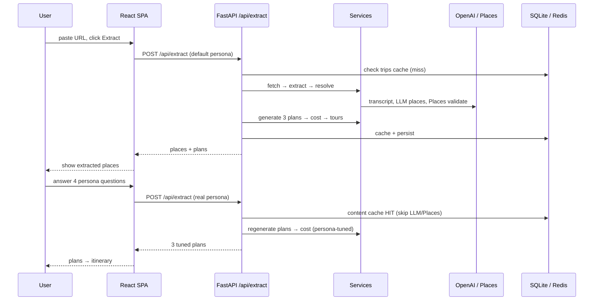
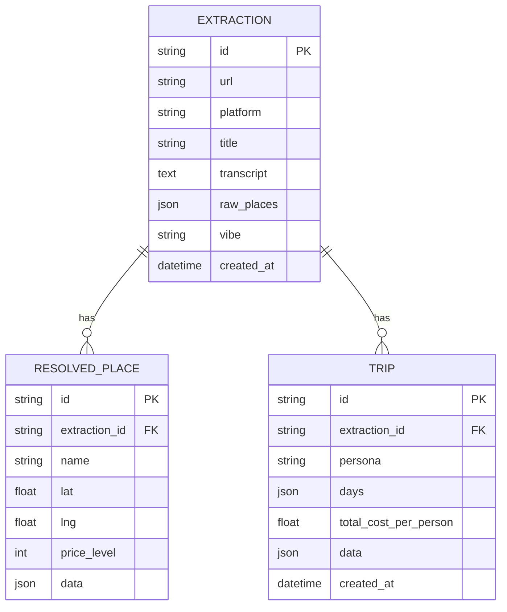

# Architecture — Reel → Itinerary

This document goes a level deeper than the [README](README.md): how the pieces
fit, what each module owns, the request lifecycle, the data + cost models, and
how the system behaves when things go wrong.

---

## 1. System overview

Two processes, one data flow.

```
┌──────────────────────────┐        ┌───────────────────────────────────────┐
│  Frontend (React + Vite) │  /api  │  Backend (FastAPI, async)               │
│  :5173                   │ ─────► │  :8000                                  │
│  6-screen SPA            │  proxy │                                         │
│                          │        │  routes → services → (LLM/Places/FX)    │
└──────────────────────────┘        │                    ↓                    │
                                     │            SQLite  +  Redis             │
                                     └───────────────────────────────────────┘
        external: OpenAI · YouTube Data API · Google Places (New) · open.er-api.com
```

- **Frontend** is a stateless SPA. It never talks to third parties directly —
  everything goes through the backend via Vite's dev proxy (`/api → :8000`), so
  there's a single origin and no CORS in development.
- **Backend** is a thin routing layer over a set of single-responsibility
  services that form the pipeline. It owns all secrets and all external calls.

---

## 2. Request lifecycle

The frontend deliberately makes the pipeline call **twice**, because the design
shows extracted places *before* asking persona questions, but the backend needs
a persona to generate plans. The first call uses a default persona (to reveal
places); the second, after onboarding, regenerates plans tuned to the user.
Content extraction is cached, so the second call only re-runs trip generation.



---

## 3. Module responsibilities

| Module | Owns |
|--------|------|
| `api/routes/extraction.py` | Orchestrates the whole pipeline; caching; no-places edge case; persistence |
| `api/routes/trips.py` | Read persisted extractions/plans (history, by id) |
| `api/routes/tours.py` | Tour lookup by city |
| `api/routes/fx.py` | Live USD-based FX rates, cached |
| `services/content_fetcher.py` | **F-01** — YouTube (Data API + transcript) & Instagram (instaloader → yt-dlp cookies.txt → browser cookies) |
| `services/llm_extractor.py` | **F-02a** — LLM place + vibe extraction; destination-only capture; mock fallback |
| `services/places_resolver.py` | **F-02b** — Google Places (New) validation; mock enrichment fallback |
| `services/persona_manager.py` | **F-03** — persona presets |
| `services/trip_generator.py` | **F-04** — 3 plans, region grouping, coverage net, day-count logic |
| `services/cost_estimator.py` | **F-05** — deterministic per-person costs |
| `services/tour_recommender.py` | **F-06** — persona/city/budget tour matching |
| `models/` | SQLAlchemy engine, ORM models, repository |
| `utils/cache.py` | Redis helpers (graceful no-Redis) |
| `utils/validators.py` | URL parsing + platform detection |
| `core/` | Settings, exceptions, middleware |

Each service is independently callable and unit-tested — the route just wires
them together.

---

## 4. The pipeline, stage by stage

**1 · Fetch** (`content_fetcher`)
- YouTube: `youtube-transcript-api` for the transcript + Data API v3 for title/description/tags.
- Instagram: tries `cookies.txt` (headless) → instaloader → live browser cookies. Caption + hashtags only, no media download.
- Output: `{ platform, title, description, transcript, tags }`.

**2 · Extract** (`llm_extractor`)
- gpt-4o-mini in JSON mode with a structured prompt. Pulls specific places (name, type, activity_type, estimated_location) + an overall `vibe`.
- If the caption only names a destination (no venues), returns that destination as a single place so the generator can build a city break instead of returning empty.
- No key → deterministic mock extraction (keyword-based).

**3 · Resolve** (`places_resolver`)
- Each place → Google Places (New) `searchText`: coordinates, category, price tier, rating.
- 403 / no key / quota → mock enrichment (city-level coordinates from a lookup). Trips still generate.

**4 · Generate** (`trip_generator`)
- One LLM call produces 3 persona plans. The prompt enforces: group by region → order nearest-first → cover **every** place → match pace (stops/day).
- Post-processing: a coverage net re-inserts any place the LLM dropped (placed by region), and a per-day cap splits overflow into same-region continuation days — without flattening the geographic grouping.
- Day count: `max(2, ceil(places ÷ stops_per_day))` (capped 7); destination-only reels use a pace-based length (relaxed 4 / moderate 3 / packed 2).

**5 · Cost** (`cost_estimator`) — see §6.

**6 · Tours** (`tour_recommender`)
- Scores the mock catalogue per stop by city/country match, activity relevance, budget fit, rating; returns the top 1–2 per stop.

---

## 5. Data model & persistence



Every run is persisted (best-effort — a DB failure is logged, never breaks the
response). `models/repository.py` is the only place that touches the session.

---

## 6. Cost model (deterministic)

The LLM never produces money. `cost_estimator.py` computes everything, per person, in USD:

| Component | Formula |
|-----------|---------|
| Flights | `FLIGHT_TIER_BASE[tier] × class_mult` — tier ∈ {domestic 180, regional 450, international 850}; class ∈ {budget ×0.85, comfort ×1.0, luxury ×2.6} |
| Accommodation | `nightly[style][budget] × nights × ceil(party/2) ÷ party` — rooms shared, split per person |
| Food | `per_day[style][budget] × days` |
| Transport | `per_day[style][budget] × days` |
| Activities | `per_stop[style][budget] × num_stops` |

- **Flight tier** is inferred from the destination country (`COUNTRY_TIER_HINTS`), defaulting to international when origin is unknown.
- **Room sharing** is the only place headcount matters — solo pays a full room, a couple splits one, a family of 5 needs 3 rooms. Everything else is genuinely per-person.
- The plan tier (budget/comfort/luxury) maps to `(travel_style, budget_range)` in the route; the user's `group_type` + `party_size` are layered on top.

Result: every number is reproducible and explainable — no run-to-run drift.

---

## 7. Persona → generation

Onboarding (4 questions) maps to the backend `PersonaInput`:

| Question | Field | Effect |
|----------|-------|--------|
| Budget | `travel_style` + `budget_range` | picks recommended plan + cost tiers |
| Group | `group_type` | room-sharing + activity framing |
| (if family/friends) headcount | `party_size` | rooms → per-person accommodation |
| Pace | `pace_preference` | stops/day → trip length |
| Style | (summary only) | flavours the copy; backend plans stay the 3 tiers |

---

## 8. Caching (Redis, all optional)

| Key | Holds | TTL |
|-----|-------|-----|
| `content:{url}` | raw content + extraction + resolved places | 7 days |
| `trips:{url}:{personaHash}` | full response (persona hash includes party_size) | 1 day |
| `places:{md5(query)}` | resolved place | 7 days |
| `fx:usd` | live currency rates | 12 h |

The persona hash includes `party_size`, so changing headcount doesn't return
stale costs. No Redis → every lookup is a miss; the app still works.

---

## 9. Graceful degradation

| Failure | Behaviour |
|---------|-----------|
| No Redis | No caching; full pipeline each time |
| No / blocked Places key (403) | City-level coordinate fallback; trips still generate |
| No transcript | Title + description only |
| No OpenAI key | Deterministic mock extraction + mock trips |
| FX provider down | Static fallback rate table |
| Instagram not authenticated | Clear `422` telling the user to set cookies |
| **No places found** | Explicit `no_places_found` status + message — never a fabricated trip |

---

## 10. Technology choices

- **FastAPI (async)** — the pipeline is I/O-bound (network calls to OpenAI, YouTube, Places, FX); async lets a single worker overlap them cheaply.
- **gpt-4o-mini** — cheap and strong enough for entity extraction + geographic grouping; the provider is swappable via `OPENAI_BASE_URL`.
- **SQLite** — the brief said lightweight is fine; zero-ops, async via aiosqlite. Swappable for Postgres by changing `DATABASE_URL`.
- **Redis** — optional cache for repeated URLs (exactly the brief's suggestion); the app degrades cleanly without it.
- **React + Vite** — fast dev server, simple proxy to the API, no build step needed to iterate.

---

## 11. Security notes

- No auth system (per the brief) — endpoints are guarded only by being internal; a `user_id`/session could be added later.
- Secrets live in `.env` (gitignored). `cookies.txt` is a live Instagram credential and is gitignored.
- CORS is open in dev; would be locked to the deployed origin in production.
- Input is validated with Pydantic (backend) + explicit checks (frontend); URLs are pattern-matched before any fetch.

---

## 12. Scaling

Back-of-envelope cost + quota analysis for 100K MAU is in **[COST_ESTIMATE.md](COST_ESTIMATE.md)** — LLM tokens, YouTube quota, Places calls, tours. The Redis URL-cache is the single biggest lever (most saved reels are re-shared popular videos).
