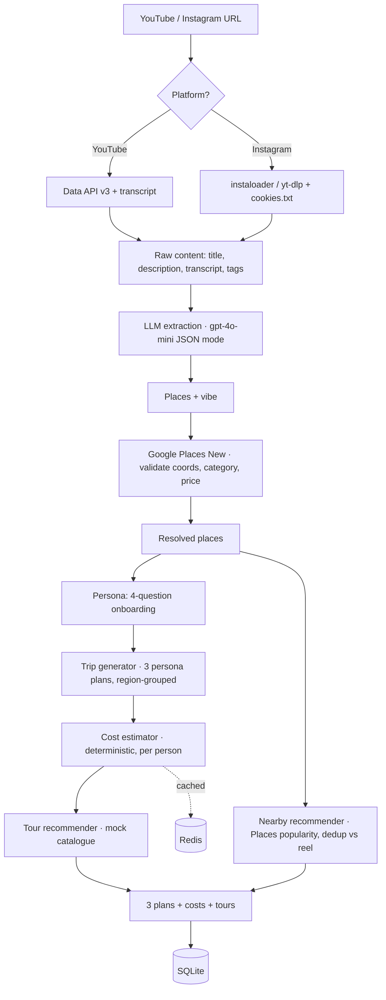

# Enchanté · Reel → Itinerary

**Turn a travel reel you saved and forgot about into a real, day-by-day trip you could actually book.**

---

## The problem, in plain English

We all do it. It's late, you're scrolling, and a gorgeous reel slides past — *"10 places you can't miss in Bali."* You tap **save**. It joins the other 300 saved reels you will never open again.

There's a real gap between **"I saved this"** and **"I booked this."** Saving a reel is a spark of intent; a trip is a hundred boring decisions — *which places, what order, how many days, where to sleep, what it costs, what to actually book.* That friction is where the intent dies.

**This app is the layer that lives in that gap.** You paste one link and it does the boring hundred-decisions part for you:

1. It **watches the reel for you** — reads the transcript, the caption, the description, the hashtags.
2. It **pulls out every real place** mentioned (an LLM does this) and checks each one against Google Places for coordinates, category and price tier.
3. It **asks you 4 quick questions** about how *you* travel (style, budget, who's coming, how fast you move).
4. It hands you **three complete trips** — *Budget Backpacker*, *Comfort Traveller*, *Luxury Escape* — each planned day-by-day, grouped so you're not zig-zagging across a city, each with a **real per-person cost breakdown** and **matching tours** you could book.

So the reel stops being a screenshot in your camera roll and becomes an itinerary with a price tag.

> This was built as a take-home for **Enchanté Brands**. The brief was explicit that it's *not* a UI exercise — the interesting parts are the **extraction quality**, the **persona logic**, and **how well the trip matches what was actually in the reel**. So that's where most of the thought went. (The UI is still nice, though.)

---

## See it work (a real run)

**Input** — a real Kerala travel vlog:
```
https://www.youtube.com/watch?v=uQpiQ4nbM-U
```
Persona: *Comfort · mid budget · couple · moderate pace*

**What comes out:**
- **11 real places** extracted from the video: Munnar, Eravikulam National Park, Alleppey Backwaters, Athirapally Waterfalls, Kovalam Beach, Varkala Beach, Kanyakumari, Shree Padmanabhaswamy Temple, Jatayu Earth Center… (from title + description; this video's transcript is Hindi-only, and it *still* worked)
- **Three costed plans (per person):**

  | Plan | Days | Total | Flights | Hotel | Food | Transport | Activities |
  |------|------|-------|---------|-------|------|-----------|------------|
  | Budget Backpacker | 3 | **$525** | 382 | 28 | 45 | 15 | 55 |
  | Comfort Traveller | 3 | **$1,167** | 450 | 132 | 165 | 90 | 330 |
  | Luxury Escape | 3 | **$4,140** | 1,170 | 660 | 540 | 450 | 1,320 |

Full step-by-step output for a YouTube vlog, an Instagram reel, and a no-places edge case is in **[TEST_CASES.md](TEST_CASES.md)**.

---

## How it's built

### The pipeline



Same thing as ASCII, for the terminal readers:

```
URL → Fetch (transcript/caption/meta) → LLM extract (places + vibe)
    → Google Places validate → Persona (4 Qs)
    → Generate 3 plans (region-grouped) → Cost (deterministic) → Tours
    → persist to SQLite   (repeat URLs cached in Redis)
```

### The one design decision that matters most

**The LLM extracts and arranges. It does *not* price.**

gpt-4o-mini is great at reading a reel and pulling out "Uluwatu Temple, Atlas Beach Club, Nusa Penida" and grouping them by region. It is *not* reliable at inventing dollar amounts — ask it for costs and you get confident nonsense that changes every run.

So costs come from a **deterministic model** (`app/services/cost_estimator.py`), not the LLM. Every number is reproducible and explainable:
- **Flights** — if you tell us where you're **flying from**, the fare is priced on the real great-circle distance between your origin and the destination (`≈ $60 + $0.09/km` round-trip × cabin class), so Mumbai→Zurich and London→Zurich come out honestly different. Origin/destination coordinates come from a fast local table for common cities and a **cached Google geocode for anything else**, so the distance is real for *any* city you type — not a hardcoded list. (The distance is exact; the per-km fare is still an indicative model — a true fare needs a flight API.) No origin given → we fall back to an indicative destination tier (domestic / regional / international) × cabin class.
- **Accommodation** — per-night rate × nights × **rooms**, where `rooms = ceil(party_size / 2)`, then divided across the party. So a couple sharing pays less per person than a solo traveller, and a family of 5 needs 3 rooms — modeled honestly, not a naive "divide by N."
- **Food / transport** — per-day rates × days.
- **Activities** — per-stop rate × number of stops.

The LLM's only job on the money side is nothing. It just decides *which places, which day, in what order*.

### The other decisions worth knowing

- **Persona actually drives the plans.** The 4 onboarding answers aren't cosmetic: **pace** sets stops-per-day (relaxed→2, packed→4), **budget** picks the recommended tier, **group type + party size** change room-sharing and cost. The three plans are the same destination at three honestly-different budget tiers.
- **Days come from the content, not a fixed number.** For a reel with real places, `days = ceil(places ÷ stops-per-day)`, then geography decides the final grouping (nearby places share a day; far-apart ones split). For a reel that only names a city ("explore Delhi in one day"), there's nothing to sequence — so we suggest a sensible multi-day city break of real highlights, length driven by pace.
- **Nearby places are guaranteed onto the same day.** Two stops a few km apart should never land on different days. After generation, stops are clustered by real great-circle distance (union-find, ≤30 km) using the resolved coordinates and every cluster is forced onto one day — a deterministic guarantee, not a hope pinned on the LLM.
- **We also surface what the reel *missed*.** A reel only covers what the creator filmed. So we take the centre of the extracted places, ask Google Places for the top popularity-ranked attractions within 25 km, keep only well-reviewed ones (rating ≥ 4.0, 500+ reviews) and remove anything already in the reel — a purely additive "famous spots nearby" list shown alongside the itinerary.
- **Verified place details flow to the UI.** Each place carries its Google rating, price tier and real address, shown on both the places screen and every itinerary stop, so the plan reads as checked-against-reality rather than model-invented.
- **Tours come from a curated mock catalogue, not Google Places.** Places returns POIs, not bookable tours with a real price and duration — treating them as tours would be misleading. The catalogue (`data/mock_tours.json`, 31 entries) mirrors a GetYourGuide/Viator response shape, so swapping in a real API later is one function.
- **Currency is live.** Backend computes USD; the UI converts using real rates fetched from a free provider (`/api/fx`, ~160 currencies, cached 12h), formatted per-currency with `Intl.NumberFormat`. Static rates exist only as an offline fallback.
- **Everything degrades gracefully.** No Redis → no-cache. No Places key / quota → mock enrichment (trips still generate). No transcript → title + description only. No places found → an honest "no places" screen, *not* a fabricated trip.

### Feature checklist (the brief's F-01…F-06)

| # | Feature | Where |
|---|---------|-------|
| F-01 | Content ingestion (YouTube + Instagram, transcript/caption/tags) | `services/content_fetcher.py` |
| F-02 | AI place extraction + Google Places validation | `services/llm_extractor.py`, `services/places_resolver.py` |
| F-03 | Persona capture (4 questions: style, budget, group, pace) | frontend persona screen → `schemas/extraction.py` |
| F-04 | 3 distinct persona-tuned trip plans | `services/trip_generator.py` |
| F-05 | End-to-end per-person cost breakdown (distance-based flights) | `services/cost_estimator.py` |
| F-06 | 1–2 tours per stop, persona-matched | `services/tour_recommender.py` |
| ✚ | Nearby famous-spot recommendations (not in the reel) | `services/nearby_recommender.py` |

---

## Tech stack

| Layer | Choice |
|-------|--------|
| Backend | Python 3.11+ / **FastAPI** (async) |
| LLM | **OpenAI `gpt-4o-mini`** (JSON mode). `OPENAI_BASE_URL` is configurable, so any OpenAI-compatible provider works. |
| Places | **Google Places API (New)** with graceful fallback |
| Frontend | **React + Vite** (single-page, 6 screens) |
| Database | **SQLite** (async via aiosqlite) |
| Cache | **Redis** (optional — degrades to no-cache) |
| YouTube | youtube-transcript-api + YouTube Data API v3 |
| Instagram | instaloader + yt-dlp (`cookies.txt` for headless — see below) |
| Tours | Mock catalogue (31 entries, 13 cities) |
| FX | open.er-api.com (live, cached) |

---

## Getting it running

You need **two terminals**: the FastAPI backend and the Vite frontend.

### 1. Backend

```bash
git clone https://github.com/meetvaghani12/reel-to-itinerary.git
cd reel-to-itinerary/backend
python -m venv venv && source venv/bin/activate
pip install -r requirements.txt
cp .env.example .env      # then fill in your keys (see below)
uvicorn app.main:app --reload --port 8000
```

### 2. Frontend

```bash
cd reel-to-itinerary/frontend
npm install
npm run dev               # http://localhost:5173  (proxies /api → :8000)
```

Open **http://localhost:5173**. That's it.

> Optional: `redis-server` in another terminal enables caching of repeated URL extractions. The app works fine without it.

### API keys

| Key | Where | Notes |
|-----|-------|-------|
| `OPENAI_API_KEY` | platform.openai.com | gpt-4o-mini ≈ $0.001–0.003 per extraction |
| `YOUTUBE_API_KEY` | Google Cloud Console | Free, 10K units/day |
| `GOOGLE_PLACES_API_KEY` | Google Cloud Console | Enable **Places API (New)** + billing. Without it, place resolution falls back to city-level coordinates and trips still generate. |
| `INSTAGRAM_COOKIES_FILE` | (see below) | Path to an exported `cookies.txt` for Instagram reels |

### Instagram setup (for reel URLs)

Instagram blocks anonymous access, so reel fetching needs your session cookies:

1. Log into Instagram in your browser.
2. Install the **"Get cookies.txt LOCALLY"** extension (Chrome/Firefox).
3. On `instagram.com`, export → save as `cookies.txt`.
4. `INSTAGRAM_COOKIES_FILE=/absolute/path/to/cookies.txt` in `.env`.

Reels then work headlessly. Cookies expire; re-export when fetches start failing. **YouTube needs none of this.**

---

## API surface

| Method | Path | Purpose |
|--------|------|---------|
| POST | `/api/extract/` | Run the full pipeline for a URL + persona → places, 3 plans, tours |
| GET | `/api/trips/` | Recently processed extractions (history) |
| GET | `/api/trips/extraction/{id}` | Full saved result for an extraction |
| GET | `/api/trips/{trip_id}` | A single persisted plan |
| GET | `/api/tours/?city=…&persona=…` | Tour lookup by city |
| GET | `/api/fx/` | Live USD-based currency rates (cached) |
| GET | `/health` | Liveness |

Interactive docs at `http://localhost:8000/docs`.

---

## Storage & caching

- **SQLite** persists every extraction: the extraction row, its resolved places, and all generated plans (`app/models/`, `repository.py`). Retrieve later via `/api/trips/...`.
- **Redis** caches by URL (content + resolved places, 7-day TTL) and by URL+persona (full result), plus live FX rates (12h). Repeated URLs skip the LLM + Places calls entirely. All optional — the app runs without Redis.

---

## Known limitations (honest ones)

1. **Instagram needs cookies.** Without `INSTAGRAM_COOKIES_FILE` it falls back to browser cookies (dev machine only) and otherwise fails with a clear `422`. Cookies expire. YouTube is the reliable path.
2. **Reel captions vary wildly.** A caption that names venues extracts beautifully; one that just says "explore Delhi" gives us only the destination — so we *suggest* highlights rather than pretending we saw them. The real spots are in the video, which we don't download (per the brief).
3. **Places API must be enabled + billed.** Otherwise coordinates are city-level approximations (trips still generate).
4. **Flights are indicative.** With an origin the *distance* is real (great-circle, with any city geocoded via Google) — but the **per-km fare is a model**, not a live quote. Real airfares depend on demand, season and carrier, which distance can't capture; a true fare needs a flight API (Amadeus/Skyscanner). Without an origin we fall back to a destination tier.
5. **FX is daily, not live-market.** Fine for indicative trip costs.
6. **Tours are a mock catalogue** (31 entries). Real coverage needs a GetYourGuide/Viator key — the matching logic is already there.
7. **Nearby recommendations need the Places key.** Without it (or on any API error) the "famous spots nearby" list is simply empty — the itinerary still renders fully.

---

## Project structure

```
reel-to-itinerary/
├── CLAUDE.md                  # project guide + engineering rules (for AI-assisted dev)
├── SKILLS.md                  # the pre-work plan: approach, tech choices, milestones
├── README.md  ARCHITECTURE.md  COST_ESTIMATE.md  TEST_CASES.md
├── docker-compose.yml         # api + redis
├── backend/
│   ├── app/
│   │   ├── main.py            # FastAPI app factory + routers
│   │   ├── api/routes/        # extract, trips, tours, fx
│   │   ├── core/             # config, exceptions, middleware
│   │   ├── models/           # SQLAlchemy models + repository
│   │   ├── schemas/          # Pydantic request/response
│   │   ├── services/         # pipeline (fetch→extract→resolve→generate→cost→tours)
│   │   └── utils/            # cache, validators
│   ├── data/mock_tours.json  # 31-entry tour catalogue
│   ├── tests/                # pytest (24 tests)
│   ├── requirements.txt  pyproject.toml  Dockerfile  .env.example
└── frontend/                  # React + Vite SPA (6 screens)
    ├── src/App.jsx           # landing → extract → places → persona → plans → itinerary
    └── src/{api,data,style}.js
```

## More docs

- **[ARCHITECTURE.md](ARCHITECTURE.md)** — deeper design notes
- **[TEST_CASES.md](TEST_CASES.md)** — YouTube vlog + Instagram reel + edge case, with real output
- **[COST_ESTIMATE.md](COST_ESTIMATE.md)** — what this costs at 100K MAU (LLM tokens, YouTube quota, Places calls, tours)

## Tests

```bash
source venv/bin/activate
pytest -q        # 24 passing — extraction, trips, cost, tours, persistence, API
```
